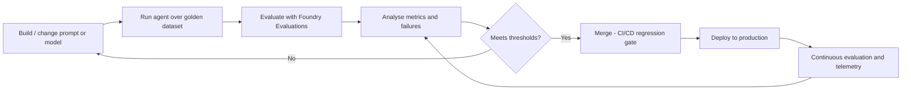

## Foundry Evaluations

This page describes a **code-first** evaluation strategy for the [scenario classification agent](issue-4-kpis/4a-scenario-classification.md), built on **Microsoft Foundry Evaluations** and driven from Python (not the UI). It is written to slot into the **agent development lifecycle** so that every prompt or model change is measured against a fixed benchmark before it reaches production.

For how to build the benchmark itself, see [Building the evaluation dataset](issue-4-kpis/dataset-guidance.md).

## Where evaluation fits in the lifecycle



- **Offline (pre-merge) evaluation** is the primary gate: run the classifier over the golden dataset and compare predictions to ground-truth labels.
- **Regression gate** in CI/CD blocks a change that drops accuracy or recall below agreed thresholds.
- **Model-migration validation** re-runs the same evaluation when the underlying model is retired (for example moving from GPT-4o to a GPT-5.x deployment) so behaviour is re-validated before switching.
- **Continuous (online) evaluation** samples production traffic and feeds telemetry back for monitoring.

## What to evaluate for this use case

Scenario classification is a **single-label classification** task with a known correct answer per email, so the core evaluators are **objective** (exact-match against the ground-truth label) rather than LLM-judged:

| Metric | Type | Why |
|--------|------|-----|
| Scenario accuracy (exact match) | Code-based | Does the predicted scenario equal the ground-truth label |
| Per-scenario precision and recall | Aggregation | Locate weak scenarios; track the poor **unknown** recall called out in [4.a](issue-4-kpis/4a-scenario-classification.md) |
| Unknown recall | Aggregation | The current blocker - track it explicitly |
| Reclassification / override rate | Aggregation | Proxy for how often a specialist would need to correct the bot |

Precision and recall per scenario $s$:

$$\text{precision}_s = \frac{TP_s}{TP_s + FP_s} \qquad \text{recall}_s = \frac{TP_s}{TP_s + FN_s}$$

> [!NOTE]
> Built-in text evaluators (`builtin.f1_score`, `builtin.similarity`, coherence, groundedness) target free-text responses and are **not** the right fit for a discrete class label. Use a **custom code-based evaluator** for exact-match scoring, then aggregate the per-item results into precision/recall and a confusion matrix.

## Prerequisites

Prefer the SDKs over raw REST calls.

```bash
pip install "azure-ai-projects>=2.0.0b2" azure-identity openai
```

- A Foundry project endpoint and a model deployment name.
- Authentication via `DefaultAzureCredential` (Managed Identity in CI/CD; `az login` locally).
- A golden dataset in **JSONL** - see [Building the evaluation dataset](issue-4-kpis/dataset-guidance.md).

## Step 1 - Collect predictions (agent runner)

Foundry evaluates rows that already contain the model's `response`. First run the **existing classification prompt** over each dataset row to produce a predicted scenario, then write an evaluation JSONL with `query`, `response`, and `ground_truth`.

```python
import json
from azure.identity import DefaultAzureCredential
from azure.ai.projects import AIProjectClient

ENDPOINT = "<your-foundry-project-endpoint>"
CLASSIFIER_DEPLOYMENT = "<your-classifier-model-deployment>"

def build_query(row: dict) -> str:
    # Mirror exactly what production sends: subject, body, timestamp, sender.
    return json.dumps({
        "subject": row["subject"],
        "body": row["body"],
        "timestamp": row["timestamp"],
        "sender": row["sender"],
    })

with (
    DefaultAzureCredential() as credential,
    AIProjectClient(endpoint=ENDPOINT, credential=credential) as project_client,
    project_client.get_openai_client() as openai_client,
):
    with open("golden.jsonl") as fin, open("eval_input.jsonl", "w") as fout:
        for line in fin:
            row = json.loads(line)
            query = build_query(row)
            # Reuse the production classification prompt as the system message.
            completion = openai_client.chat.completions.create(
                model=CLASSIFIER_DEPLOYMENT,
                messages=[
                    {"role": "system", "content": CLASSIFICATION_PROMPT},
                    {"role": "user", "content": query},
                ],
                temperature=0,
            )
            predicted = completion.choices[0].message.content  # e.g. "scenario_3" or "unknown"
            fout.write(json.dumps({
                "id": row["id"],
                "query": query,
                "response": predicted,
                "ground_truth": row["ground_truth"],
            }) + "\n")
```

> [!TIP]
> Keep the runner as thin as possible and reuse the **exact** production prompt and pre-processing (clean body/subject). If the runner and production diverge, the evaluation no longer reflects reality.

## Step 2 - Custom code-based evaluator (exact match)

```python
from azure.ai.projects.models import EvaluatorDefinitionType

def normalise(value: str) -> str:
    return (value or "").strip().lower()

scenario_match = project_client.evaluators.create_version(
    name="scenario_exact_match",
    evaluator_version={
        "name": "scenario_exact_match",
        "definition": {
            "type": EvaluatorDefinitionType.CODE,
            "code_text": """
def grade(sample, item):
    def norm(v):
        return (v or "").strip().lower()
    predicted = norm(item.get("response"))
    truth = norm(item.get("ground_truth"))
    return 1.0 if predicted == truth else 0.0
""",
            "init_parameters": {
                "required": ["pass_threshold"],
                "type": "object",
                "properties": {"pass_threshold": {"type": "number"}},
            },
            "metrics": {
                "result": {"type": "boolean", "min_value": 0.0, "max_value": 1.0}
            },
            "data_schema": {
                "required": ["item"],
                "type": "object",
                "properties": {
                    "item": {
                        "type": "object",
                        "properties": {
                            "response": {"type": "string"},
                            "ground_truth": {"type": "string"},
                        },
                    }
                },
            },
        }
    },
)
```

## Step 3 - Create and run the evaluation

```python
import time
from openai.types.eval_create_params import DataSourceConfigCustom
from openai.types.evals.create_eval_jsonl_run_data_source_param import (
    CreateEvalJSONLRunDataSourceParam, SourceFileID,
)

# Upload the eval input produced in step 1.
dataset = project_client.datasets.upload_file(
    name="scenario-eval-data", version="1", file_path="eval_input.jsonl",
)

data_source_config = DataSourceConfigCustom({
    "type": "custom",
    "item_schema": {
        "type": "object",
        "properties": {
            "query": {"type": "string"},
            "response": {"type": "string"},
            "ground_truth": {"type": "string"},
        },
        "required": ["response", "ground_truth"],
    },
    "include_sample_schema": True,
})

testing_criteria = [{
    "type": "azure_ai_evaluator",
    "name": "scenario_exact_match",
    "evaluator_name": "scenario_exact_match",
    "initialization_parameters": {"pass_threshold": 1},
}]

evaluation = openai_client.evals.create(
    name="scenario-classification-eval",
    data_source_config=data_source_config,
    testing_criteria=testing_criteria,
)

run = openai_client.evals.runs.create(
    eval_id=evaluation.id,
    name="scenario-classification-run",
    data_source=CreateEvalJSONLRunDataSourceParam(
        type="jsonl", source=SourceFileID(type="file_id", id=dataset.id),
    ),
)

while run.status not in ("completed", "failed"):
    run = openai_client.evals.runs.retrieve(run_id=run.id, eval_id=evaluation.id)
    time.sleep(3)

print("Report URL:", run.report_url)
```

## Step 4 - Aggregate per-scenario metrics

The exact-match evaluator gives overall accuracy. For **per-scenario precision/recall and a confusion matrix** (including unknown recall), pull the per-item results and aggregate locally.

```python
from collections import Counter

output_items = list(
    openai_client.evals.runs.output_items.list(run_id=run.id, eval_id=evaluation.id)
)

tp, fp, fn = Counter(), Counter(), Counter()
for item in output_items:
    data = item.model_dump()
    predicted = normalise(data["datasource_item"]["response"])
    truth = normalise(data["datasource_item"]["ground_truth"])
    if predicted == truth:
        tp[truth] += 1
    else:
        fp[predicted] += 1
        fn[truth] += 1

for label in sorted(set(tp) | set(fp) | set(fn)):
    precision = tp[label] / (tp[label] + fp[label]) if (tp[label] + fp[label]) else 0.0
    recall = tp[label] / (tp[label] + fn[label]) if (tp[label] + fn[label]) else 0.0
    print(f"{label:20s} precision={precision:.2f} recall={recall:.2f}")
```

## Step 5 - Turn results into a regression gate

Wire the run into CI/CD so a change cannot merge if it regresses:

- Fail the pipeline when **overall accuracy** or **unknown recall** drops below the agreed threshold, or below the previous baseline by more than a set margin.
- Store each run's metrics as the new baseline on merge to `main`.
- Attach `run.report_url` to the pull request for reviewers.

```python
THRESHOLDS = {"overall_accuracy": 0.85, "unknown_recall": 0.60}
metrics = {"overall_accuracy": ..., "unknown_recall": ...}  # from step 4
failures = {k: metrics[k] for k, floor in THRESHOLDS.items() if metrics[k] < floor}
if failures:
    raise SystemExit(f"Evaluation gate failed: {failures}")
```

## Continuous evaluation and observability

- **Tracing / telemetry** - emit traces from the classifier to Application Insights so production predictions, latencies, and reclassifications are observable. This supports the nightly self-learning loop described in [4.a](issue-4-kpis/4a-scenario-classification.md).
- **Online sampling** - periodically sample production emails, obtain SME labels, and fold them back into the golden dataset (a new dataset version) so the benchmark stays representative.
- **Analytics** - route telemetry to a store you can query (for example Microsoft Fabric) for trend dashboards on accuracy, recall, and reclassification rate over time.

## Checklist

- [ ] Golden dataset in JSONL with `ground_truth` labels - see [dataset guidance](issue-4-kpis/dataset-guidance.md).
- [ ] Thin agent runner reusing the production prompt and pre-processing.
- [ ] Custom code-based exact-match evaluator registered in Foundry.
- [ ] Evaluation created and run via the Projects SDK / OpenAI evals API.
- [ ] Per-scenario precision/recall and unknown recall aggregated.
- [ ] Regression gate wired into CI/CD with agreed thresholds.
- [ ] Model-migration re-validation step defined.
- [ ] Tracing and periodic dataset refresh in place.
