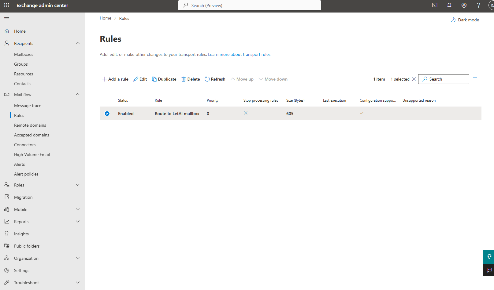
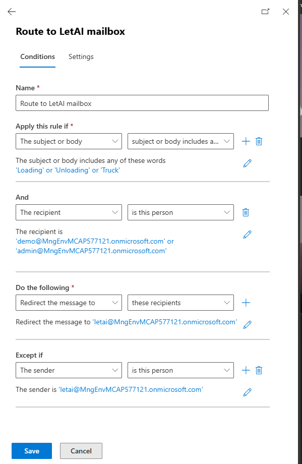
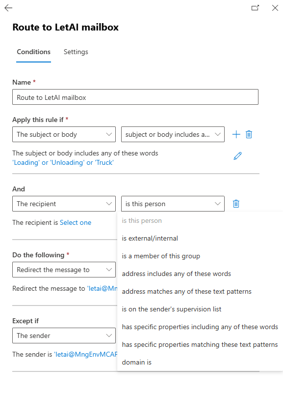

## Issue 2 - Centralized Exchange mail flow rules

Each business-user mailbox carries a **centralised redirection rule** that forwards external customer mail to the **bot ID** so the solution can pick it up. The ask is to manage these rules centrally and selectively.

## How it works today

- When a business-user receives mail from external persons or customers, a redirection rule set on the mailbox forwards it to the **bot ID**.
- This is what gives the bot its inbound feed (see [Issue 1](issue-1-non-automated-email.md) for the downstream flow).

## The problem

- The per-mailbox rule setup is **time-consuming and hard to maintain at scale**.
- Business-users also send other mail during the day (for example credit-related or personal mail) that they **do not want shared with the bot**, yet it can be forwarded unintentionally.
- They want **centralised rules** so that **only the required mail** is redirected to the bot, rather than everything.

The ask, in short: enable **centralised management or automated publishing** of redirection rules, improve **consistency**, and reduce **administrative overhead**, with selective redirection of only the mail that should reach the bot.

## Why this is a tenant-governance question

This is about the **configuration of the mail tenant**, not the application logic:

- The right owners are **Office 365 / Microsoft 365 SMEs** who handle mail-tenant configuration and rule governance.
- The **mailbox ownership needs confirming** - which organisation owns the business-user mailboxes affects which tenant and which SMEs are involved. This should be clarified before designing a solution.

## Proposed solution

Create an Exchange mail flow (transport) rule in the Exchange Admin Center. Unlike per-mailbox Outlook rules, the rule runs on the mail server, applies consistently to all users in its scope, and can be managed centrally by the tenant administrators.

Figure 1. The enabled **Route to LetAI mailbox** rule has priority 0 and a supported configuration.

Configure the rule as follows:

1. Match the trigger words, phrases, or text patterns in the message subject or body. For example, the proof of concept uses `Loading`, `Unloading`, and `Truck`.
2. Scope the rule to the intended Unilever recipients. Administrators can maintain an explicit recipient list or use a mail-enabled group so that membership controls which business-users are included.
3. Redirect matching messages to the LetAI mailbox.
4. Add an exception when the sender is the LetAI mailbox. This prevents redirected or processed messages from entering a mail loop.

Figure 2. The proof-of-concept rule combines content triggers and recipient scope, redirects matching messages, and excludes messages sent by LetAI.

For simpler ongoing administration, select **is a member of this group** as the recipient condition and manage business-user access through group membership.

Figure 3. A group-based recipient condition avoids maintaining individual users in the transport rule.

The proof-of-concept rule is named **Route to LetAI mailbox** and is enabled with the highest priority. The Exchange Admin Center confirms that its configuration is supported.

This approach removes the need to publish and maintain rules in every mailbox. It also avoids a Microsoft Graph API integration and the related application permissions, credentials, and mailbox-access security concerns.

## Validation required

- Confirm that the tenant administrators approve the server-side mail flow rule and its ownership model.
- Confirm whether the recipient scope will use a mail-enabled security group, distribution group, or explicit recipient list.
- Test the trigger terms and patterns against representative email to measure false positives and false negatives.
- Verify that the sender exception prevents loops and does not suppress valid requests.
- Confirm whether redirecting preserves the headers and message properties required by the downstream LetAI process.

## Status and next steps

- Review the proposed rule with the Office 365 / Microsoft 365 tenant administrators.
- Run a controlled pilot with a small recipient group and representative trigger terms.
- If the pilot succeeds, document the production group owner, rule owner, change process, and monitoring process before rollout.

## Related

- [Issue 1 - Handling non-automated email](issue-1-non-automated-email.md).
