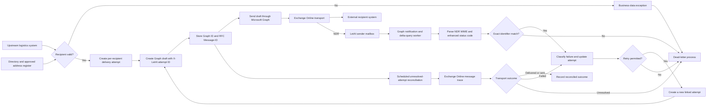

## Issue 3 - Undelivered email tracking

LetAI sends email to external parties using addresses supplied by an upstream transportation or logistics system. The solution needs to prevent avoidable failures, detect delivery failures that occur after submission, and associate each failure with the exact request and recipient.

## Context

Two recurring data-quality problems cause outbound messages to fail:

1. The upstream system supplies a known placeholder when no real address is available, for example `undelivered@example.com`.
2. The supplied address contains a typo, a misspelled domain, or a mailbox that no longer exists.

Microsoft Graph accepts outbound messages for Exchange Online processing. A successful `sendMail` or draft `send` call returns `202 Accepted`, but this confirms submission only. It does not confirm delivery to the recipient.

## Current correlation gap

Each inbound request already has a request ID, a conversation ID, and a messages array in the document database. The current outbound implementation does not establish a reliable delivery-attempt identity before sending.

The one-step Graph `sendMail` operation returns no message object in its `202 Accepted` response. An NDR is a separate message from the mail system, and its sender address is not a stable correlation key. Matching an NDR by sender, subject, or timestamp is therefore ambiguous. Two requests can have the same subject and can fail within the same time window.

The Graph message resource ID, Graph conversation ID, RFC `Message-ID`, and Exchange network message ID are different identifiers. The RFC `Message-ID`, exposed by Graph as `internetMessageId`, is the primary cross-system identifier because Exchange message trace accepts it and NDRs normally include original-message headers. The Graph resource ID is mailbox-local and can change when an item moves unless immutable IDs are requested.

### Requirements

| ID | Requirement | Proposed control |
|----|-------------|------------------|
| R1 | Reject known placeholders and malformed addresses before submission. | Validation pipeline and managed placeholder denylist |
| R2 | Use authoritative address data where Contoso controls or curates the recipient. | Internal directory or approved partner/location address register |
| R3 | Record a unique delivery attempt before calling Graph. | One immutable attempt ID per request and recipient |
| R4 | Correlate an NDR without relying on its sender, subject, or timestamp. | RFC `Message-ID`, with a custom correlation header as a secondary key |
| R5 | Track delivery independently for every recipient. | One outbound message per recipient and a per-attempt state model |
| R6 | Distinguish permanent, policy, content, routing, and potentially retryable failures. | Enhanced status code taxonomy and raw diagnostic retention |
| R7 | Route unresolved failures to an owned operational process. | Dead-letter queue, alerts, and documented remediation ownership |
| R8 | Reconcile messages for which no NDR is observed. | Exchange Online message trace using the stored RFC `Message-ID` |

## Recommended architecture



The delivery-attempt record is the system of record throughout this flow. The RFC `Message-ID` is the primary transport correlation key, and `X-LetAI-Delivery-Attempt-Id` is the secondary application key. Subject, timestamp, and NDR sender are never used to update a request automatically.

### 1. Validate before sending

Apply the following checks before creating an outbound message:

1. Trim surrounding whitespace, normalize casing where appropriate, and parse the address with a standards-aware mail-address parser.
2. Reject null values, malformed addresses, known placeholder addresses, and configured placeholder patterns.
3. If Contoso owns the domain, resolve the address against the authoritative Exchange or Microsoft Entra recipient directory.
4. If the address belongs to a managed partner or location, resolve it against an approved address register with an owner and last-verified date.
5. Optionally check whether the external domain has plausible mail routing. Treat this as a warning signal only, not proof that the mailbox exists.
6. Persist the validation result and source before attempting delivery.

> [!IMPORTANT]
> Microsoft Graph does not provide a general API that proves an arbitrary external mailbox exists. DNS or SMTP probing is also not a reliable mailbox validation mechanism because recipient servers can suppress, defer, or accept probes. Pre-send validation reduces preventable failures but cannot guarantee delivery.

A validation failure must stop the send and create a business-data exception. The exception should identify the source record and validation reason without attempting to invent or guess a replacement address.

### 2. Create and identify each delivery attempt

Use one outbound message per recipient. This avoids partial-recipient ambiguity and gives every destination an independent lifecycle.

Before calling Graph, create a delivery-attempt record containing:

* LetAI request ID
* Unique delivery-attempt ID
* Normalized recipient address
* Sender mailbox
* Validation result and source
* Creation time and current state
* Retry sequence and parent attempt ID, when applicable

Create the email as a Graph draft rather than using one-step `sendMail`. Include a custom header such as `X-LetAI-Delivery-Attempt-Id` and, if needed, `X-LetAI-Request-Id`. Graph permits custom Internet headers that begin with `x-` when a message is created.

```http
POST /users/{mailbox}/messages
Content-Type: application/json

{
  "subject": "...",
  "toRecipients": [
    {
      "emailAddress": {
        "address": "recipient@example.com"
      }
    }
  ],
  "internetMessageHeaders": [
    {
      "name": "X-LetAI-Delivery-Attempt-Id",
      "value": "<delivery-attempt-id>"
    },
    {
      "name": "X-LetAI-Request-Id",
      "value": "<request-id>"
    }
  ]
}
```

The create-draft response returns the Graph message resource, including its `id` and `internetMessageId`. Persist both values before sending the draft:

```http
POST /users/{mailbox}/messages/{draft-id}/send
```

Set the attempt state to `submitted` only after Graph returns `202 Accepted`. Do not set it to `delivered` at this point.

> [!NOTE]
> The custom header provides a LetAI-native correlation key, but the RFC `Message-ID` remains the primary transport key. Some external mail systems can omit parts of an NDR. The production test must prove which original headers are retained across the actual Contoso mail path.

### 3. Monitor the sender mailbox for NDRs

NDRs return to the sending mailbox. Monitor that mailbox with Microsoft Graph change notifications or a delta-query worker, and use a periodic delta query to recover from missed or expired subscriptions.

For each candidate NDR:

1. Retrieve the complete MIME content with `GET /users/{mailbox}/messages/{ndr-id}/$value`.
2. Parse the MIME structure with a standards-compliant MIME library.
3. Read `message/delivery-status` for the failed recipient, action, diagnostic code, and enhanced status code.
4. Read `message/rfc822` or `text/rfc822-headers` for the original `Message-ID` and `X-LetAI-Delivery-Attempt-Id`.
5. Match the stored `internetMessageId` first, then the custom delivery-attempt header.
6. Record the NDR Graph ID, NDR RFC message ID, rejected recipient, enhanced status code, SMTP diagnostic, generating server, and raw MIME retention reference.
7. Update only the matched delivery attempt and originating request.

If no exact identifier matches, place the NDR in an unmatched-NDR queue. Subject, timestamp, body text, and NDR sender can help an operator investigate, but they must never update a request automatically.

### 4. Classify the failure

Exchange NDRs use enhanced status codes. A `4.x.x` code indicates a temporary condition and a `5.x.x` code indicates a permanent failure, but the full code and diagnostic text determine the remediation.

| Category | Typical codes | Treatment |
|----------|---------------|-----------|
| Invalid or unknown recipient | `5.1.0`, `5.1.1`, `5.1.10`, `5.5.0` | Mark the address invalid, stop automatic retry, and return the source record for correction |
| Mailbox or rate limit | `4.3.x`, `4.5.3`, `5.2.2`, `5.2.121`, `5.2.122` | Check Exchange retry history and limits; retry only under an explicit policy |
| Routing, DNS, or remote connectivity | `4.4.x`, `5.4.x` | Assign to mail operations or the recipient-domain owner; avoid immediate application resend |
| Message format or content | `5.6.x` | Correct MIME, header, attachment, or size handling before creating a new attempt |
| Authorization, policy, spam, or authentication | `4.7.x`, `5.7.x` | Assign to security or mail operations; do not retry unchanged content automatically |
| Unknown or unparseable | Any unrecognized response | Preserve the raw evidence and route to manual investigation |

Do not resend solely because an NDR contains a `4.x.x` code. Exchange already retries temporary transport failures before it generates many final NDRs. A controlled retry must create a new delivery-attempt ID, point to the previous attempt, apply backoff and a retry limit, and first confirm that another copy was not delivered.

### 5. Maintain an explicit state model

Use append-only events for audit and derive the current per-recipient status from them.

```text
pending-validation
  -> validation-failed
  -> draft-created
  -> submitted
       -> delivered-confirmed
       -> delivery-failed
       -> delivery-unknown
            -> reconciled-delivered
            -> reconciled-failed
            -> manual-review
```

`delivered-confirmed` requires positive evidence from Exchange message trace or another agreed delivery signal. Absence of an NDR is not proof of delivery. For outbound internet mail, Exchange can confirm that the message was sent to the destination system, but it cannot guarantee that the external recipient read or retained it.

### 6. Reconcile unresolved attempts

Run a scheduled reconciliation process for attempts that remain `submitted` beyond the agreed service window.

Use Exchange Online message trace, filtered by the stored RFC `Message-ID`, sender, recipient, and a narrow time range. Trace events distinguish states such as `Deliver`, `Send`, `Defer`, and `Fail`. Store the resulting network message ID when available because it identifies the transport instance and supports deeper trace investigation.

Message trace is an administrative and operational control, not the primary event-ingestion API. It can lag actual delivery status, requires Exchange permissions, has retention and query limits, and is throttled. The reconciliation worker must use precise filters, bounded query frequency, and least-privilege access.

## Dead-letter and operational process

Route these records to a dead-letter process:

* Pre-send validation failures
* Permanent recipient failures
* Unmatched or unparseable NDRs
* Attempts still unresolved after message-trace reconciliation
* Retries that reach the configured limit

Each dead-letter record must include the request ID, delivery-attempt ID, recipient, source system record, validation evidence, Graph and RFC identifiers, failure category, enhanced status code, diagnostic text, attempt history, owner, and next action. Do not expose message bodies or recipient data in broad alerts; link authorized operators to the protected record instead.

Operational ownership should be split by cause:

| Cause | Primary owner | Expected action |
|-------|---------------|-----------------|
| Placeholder or incorrect source address | Business-data owner | Correct the upstream location or partner record |
| Invalid Contoso-controlled recipient | Identity or Exchange administrator | Correct the authoritative recipient object |
| Routing, connector, authentication, or policy failure | Exchange or security operations | Investigate trace and tenant configuration |
| Message construction failure | LetAI engineering | Correct and redeploy the outbound message path |
| Unmatched evidence | LetAI support with Exchange operations | Correlate manually and update mapping rules only after validation |

Monitor at least the validation-failure rate, NDR rate, unmatched-NDR count, failures by enhanced status code and source system, unresolved-attempt age, retry count, and time to remediation. Alert on sudden changes by domain, location, or failure category.

## Security and retention

* Scope Graph application access to the required sender mailbox or mailboxes.
* Grant Exchange message-trace access through the least-privileged supported role.
* Treat NDR MIME, original headers, recipient addresses, and diagnostic text as protected operational data.
* Define retention for raw NDR evidence and delivery events with the security, privacy, and records-management teams.
* Redact personal or message content from telemetry while retaining identifiers needed for audit and correlation.

## Validation plan

The solution is ready only after an end-to-end test proves the correlation path in the Contoso tenant.

1. Send distinct delivery attempts to a known invalid mailbox, invalid domain, policy-rejected recipient, and controlled valid mailbox.
2. Verify that draft creation returns and persists a unique Graph ID and RFC `Message-ID` before submission.
3. Verify that the returned NDR MIME contains the original RFC `Message-ID` or custom delivery-attempt header.
4. Verify exact correlation when two messages have the same subject and are sent within the same second.
5. Verify independent outcomes for multiple recipients by sending one message per recipient.
6. Verify NDR ingestion through both the notification path and delta-query recovery.
7. Verify the enhanced status code classification and dead-letter routing.
8. Verify message-trace reconciliation for delivered, failed, deferred, and unresolved attempts.
9. Verify that a retry creates a new attempt and cannot mark the earlier attempt as delivered.
10. Verify access controls, telemetry redaction, retention, and alert ownership.

## Status and next steps

The correlation gap has a technically viable design and no longer requires subject matching. Implementation remains conditional on the end-to-end NDR header test because external mail systems can vary in the diagnostic content they return.

1. Build a proof of concept that creates a draft with the custom headers, stores `internetMessageId`, sends it, and parses the returned NDR MIME.
2. Confirm the authoritative source and owner for Contoso-controlled, partner, and location addresses.
3. Agree the delivery state model, service window, retry policy, and dead-letter ownership with Exchange operations and business-data owners.
4. Confirm the Exchange message-trace integration method and least-privilege role for automated reconciliation.
5. Run the validation plan before enabling automatic status changes in production.

## Microsoft references

* [Create a draft message](https://learn.microsoft.com/graph/api/user-post-messages)
* [Send a draft message](https://learn.microsoft.com/graph/api/message-send)
* [Send mail](https://learn.microsoft.com/graph/api/user-sendmail)
* [Get a message or its MIME content](https://learn.microsoft.com/graph/api/message-get)
* [Microsoft Graph message resource](https://learn.microsoft.com/graph/api/resources/message)
* [NDRs and SMTP errors in Exchange Online](https://learn.microsoft.com/troubleshoot/exchange/email-delivery/ndr/non-delivery-reports-in-exchange-online)
* [Message trace in Exchange Online](https://learn.microsoft.com/exchange/monitoring/trace-an-email-message/message-trace-modern-eac)

## Related

* [Issue 1 - Handling non-automated email](issue-1-non-automated-email.md)
* [Issue 2 - Centralized Outlook re-direction rules](issue-2-redirection-rules.md)
